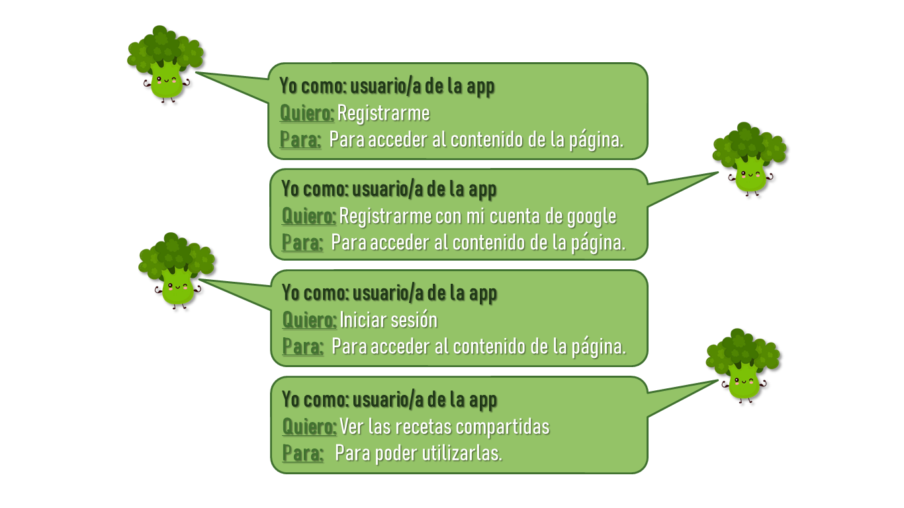

##Red Social Veggiebook 

###Definición del producto
Veggibook es una red social enfoncada en personas vegetarianas o veganas entre un rango etario desde los 18 hasta los 35 años, que están en busca de recetas fáciles, ricas y/o saludables, compartidas por personas con similares necesidades.

El objetivo de esta red social es facilitar el acceso a recetas libres de animales, a personas comunes y corrientes, lo que servirá para hacer más accesible su estilo de alimentación, creando a la vez un sentido de pertenencia. 

Luedo de establecer en grupo las funcionalidades que tendría el sitio, se crearon las Historias de usuario las cuales determinan el flujo de trabajo.

###Prototipos
En primer lugar, se crearon prototipos de baja fidelidad a partir de las Historias de usuario establecidas. De esta forma, se comenzó a establecer la arquitectura que tendría el sitio.

 
 Luego, se diseñaron los prototipos de alta fidelidad de las diferentes vistas que tendría el sitio. Se consideraron tres tipos de dispositivos para el diseño: desktop, tablet y mobile.
 
 

Se pensaron colores relacionados a un estilo de vida saludable y con un estilo de alimentación basado en plantas. 

##Testeos de usabilidad

